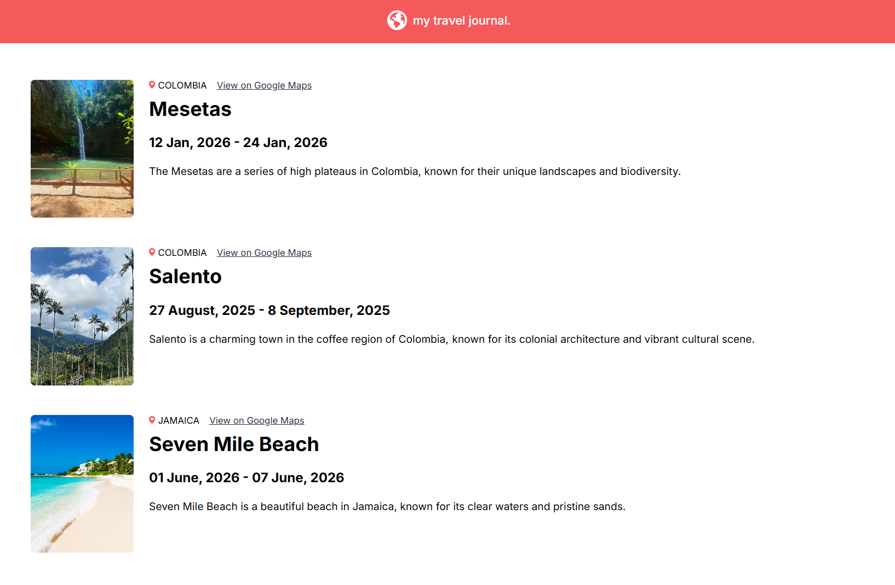

# Travel Journal

A simple travel journal built with React that displays information about different destinations from a structured data source.

This project was created to practice reusable React components, props, and dynamic rendering.

🔗 **[View Live Demo](https://traveljou.netlify.app/)**

---

## 📸 Preview

<p align="center">
  
</p>

---

## ✨ Features

- Display travel destinations dynamically from a data file.
- Show location, travel dates, description, and images for each destination.
- Link each destination to its location on Google Maps.
- Render reusable React components from structured data.

---

## 🛠️ Built With

- React
- JavaScript
- HTML5
- CSS3

---

## 📚 What I Learned

During this project I practiced:

- Creating reusable React components.
- Passing data between components using props.
- Rendering multiple components dynamically using `.map()`.
- Working with JavaScript objects and arrays as a data source.
- Separating application data from UI components.
- Understanding the basics of a component-based architecture.

---

## 🔮 Future Improvements

- Improve the responsive layout for mobile devices.
- Add filtering or searching by country.
- Add more destinations and travel information.

---

## 🚀 Getting Started

Clone the repository:

```bash
git clone YOUR_REPOSITORY_URL
```

Navigate into the project:

```bash
cd travel-journal
```

Install the dependencies:

```bash
npm install
```

Start the development server:

```bash
npm run dev
```